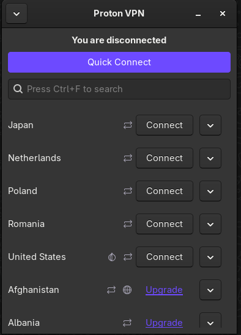

# Elevated Labs Cyber Security Internship

# Task 1
## Choosing Reputable Free VPN Service
* Chosen service : Proton VPN (Free Version)

# Task 2
## Download and Install VPN Client
* Instructions to Download and Install Proton VPN Is documented in the Official Website  to Read Docs.

# Task 3
## Connect to the VPN Server
* Proton Provides Nice GUI, With one click you can connect to any server that it provides


# Task 4 
## Verifying if my IP is changed (When using VPN)
* Note : Due to Security Concerns i will not show the IPv6 address but IPv4 will be shown

* Before Using VPN

\
-> Location : Mumbai 

* After Using VPN

\
-> Location : Japan

```Note``` : Location changed with changed IPv4 Address


# Task 5
## Browsing Web (For checking encryption)
* From browsing the web there seems to be no slowdown in communication & Communication is encrypted
* From  there is no leakage from ISP Domain and every traffic is routed through Tokyo Server (VPN)


# Task 6
## Testing Internet Speed After Disconnection
* After Disconnecting the Server there seems to be increase in internet speed (Since the traffic is resolved through local ISP DNS)
* The channel is unencrypted since the traffic is not routed through VPN Server


# Task 7 
## Understanding VPN Encryption & Privacy Features
* VPN stands for Virtual Private Network which is a tunnel which will route the traffic through it's own server in order to encrypt the communication between the server and the client 
* VPN will use series of encryption which is advanced and high standards (AES) which will encrypt the entire communication
When you connect to a VPN, it encrypts your internet traffic before it leaves your device. This encryption is a type of encoding that jumbles your data so that anyone who tries to intercept it can’t read it.
* The encrypted data is sent through a VPN tunnel to the VPN server. The tunnel ensures that your data is safe from hackers, even on public networks like Wi-Fi in cafes or airports.
* Once your data reaches the VPN server, it is decrypted, and the server forwards your request to the final destination.
* When the website or service you're accessing responds, That response is sent back to the VPN server. The VPN server then encrypts the data again before sending it back through the VPN tunnel to your device.


# Task 8
## Summarizing Benefits & Limitations

### Benefits :
* Anonymity : VPN Anonymises the entire identity since the server that is receiving the packet will not have our IP address it will have VPN server IP Address
* Encrypted Channels : VPN provides security since all the channels are encrypted and there will no more leakages during communication between the server and client system
* Protection : VPN Provides security against spoofing, poisoning attacks (DNS poisoning, ARP Spoofing attack)

### Limitations :
* Limited Bandwidth : VPN Encrypts the entire communication but it might slow down your internet connection which will limit the bandwidth of network 
* Identity Disclosure : If VPN server is compromised then the entire communication will be traced by the entity that has access to that server
* Vulnerability : If VPN software has some vulnerability then it might be susceptible to attacks thus compromise of entire communication
* Legal Issues and Censorship : Some Countries Restrict the use of VPN and some even ban them
